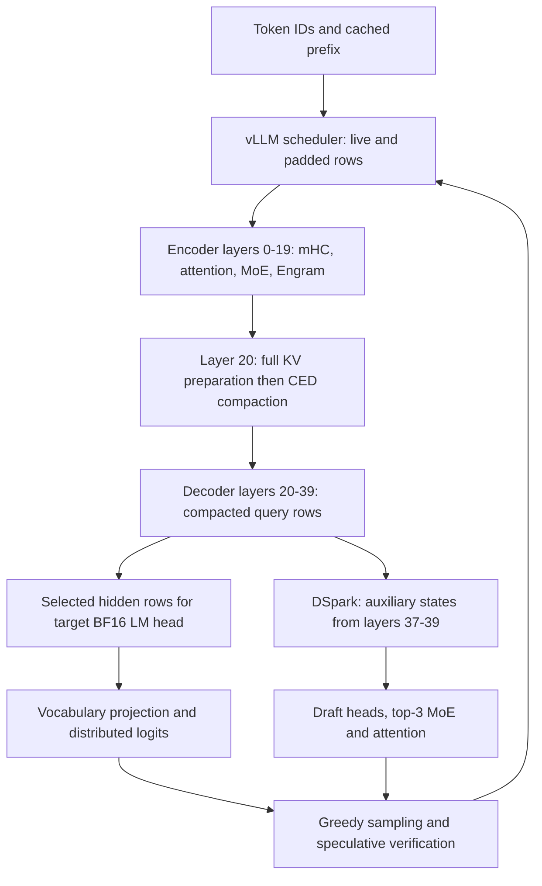

# DeepSeek V4.1 Flash serving-path audit

**Snapshot: 1 October 2026, deployment commit `6548e6c`. Production baseline: r5o.**

This document maps the **actual model-specific vLLM integration, B12X kernels, PyTorch/Triton fallbacks, communication, scheduling, and storage**. It separates production, the frozen deterministic reference (`ref2`), and unpromoted recovery candidates. It is a read-only source and saved-evidence audit: no inference requests, GPU tests, service changes, image builds, or deployments were performed for this document. “Production” means the promoted configuration, not an assertion about whichever experimental container is running at this instant.

The important conclusions are:

1. `--linear-backend b12x` does not mean every linear operation executes a B12X CuTe GEMM. The target vocabulary projection uses a **Triton row reduction for one projected row and PyTorch `F.linear` for larger plans**. B12X BF16 GEMVs can execute **PyTorch `torch.mm`/`addmm`**, as well as SIMT, MMA, and TMA kernels.
2. Dispatch depends on **prepared capacity, actual rows, dtype, model role, attention metadata, and per-rank geometry**. A prompt-length-only chart would be wrong.
3. There are several unrelated kinds of splitting: tensor parallelism, prefill sequence parallelism, scheduler chunking, CED compaction, dense split-K, mHC projection splits, MoE intermediate slices, and attention split/merge. Fixing one does not fix the others.
4. The frozen reference demonstrated target-output invariance on the recorded scenarios, at a measured cost. It is not proof of cross-restart, full-context, image-input, or arbitrary-input bit invariance.
5. **Replay coverage needs correction:** the early transition map shards the index query projection although serving replicates it, and does not reproduce the padded target query-B geometry. Its original LM-head proxy is also superseded by the later served-head replay. Details are in [evidence mismatches](evidence-mismatches.md).
6. **A separate compressor evidence mismatch needs attention:** the ratio-2 compressor replay uses one `1024 × 5120` projection, but the serving wrapper executes **two `512 × 5120` projections with FP32 output**. Their selection thresholds differ. Existing broad claims about compressor coverage and performance should be narrowed until the split serving path is replayed directly.

## Navigation

- [Source index and frozen source copies](source-index.md)
- [Key code entry points and exact line numbers](code-map.md)
- [Machine-readable provenance and checksums](provenance.json)
- [Operation inventory: 36 serving operations](operations.csv)
- [Recorded plan configurations and split counts](recorded-plan-configs.csv)
- [Replay versus serving mismatches](evidence-mismatches.md)
- [Prompt/chunk examples](prompt-boundaries.csv)
- [Explicit boundary test cases](boundary-cases.csv)
- [Saved kernel measurements](measurements/)

The inventory is organized by serving operation family, not by every generated CUDA symbol. Exact cuBLAS kernel names, launch counts and active per-boot plans require a matching runtime trace; gaps are marked rather than guessed.

Source IDs below resolve through the source index. Copied production files retain their original line numbers. Experimental patches have their own numbering namespace: **vLLM-0038 is not B12X-0004; experiment 0007 is not a production-series number.** The copies are audit evidence, not new build inputs.

## 1. Source and configuration identity

| Component | Audited identity / role |
|---|---|
| Deployment repository | `6548e6c`; configuration and experimental patches frozen here |
| Production vLLM upstream | `local-inference-lab/vllm@04c30fa98e7917fee0a24c739ea503ce1e22538d` |
| Production vLLM patched tree | `c108cd6d1fe8e2d3b91c065feefe818742159020`, production patches 0001–0026 |
| Production B12X upstream | `local-inference-lab/b12x@f8069b2c0be1311df3b112591c6b8876a843f8be` |
| Production B12X patched tree | `1a8b9401584ada0372939df49e658c3dbeae7658`, production patches 0001–0005 |
| Image | `vllm-ds41f-kkref:04c30fa98e79-r5o`; recorded image ID `sha256:288fc5bd909eb7e5fa51bd5abd94286140a0f07c40b92d763f8be4970309e5ab` |
| Model | `deepseek-ai/DeepSeek-V4.1-Flash@dba1be0a40aa45a94ad051997016db3960a90277` |
| Runtime | CUDA 13.0.2 base; CUTLASS DSL 4.7.1; SM121a compilation target; three DGX Sparks |
| NCCL | 2.30.7 rebuilt for SM121 with IB send-path fence patch; tree `47687d2a75b06fdff1b752dbf08bb87f12ca98bb` |
| FlashInfer | Runtime-base package 0.6.18.post1; the separately tracked FlashInfer Git revision is **not** a production build input |

Sources: D01–D03. The baseline manifest contains some historical descriptive values (for example a cache-path reference to r5j); executable configuration D01 is authoritative for configured values. Binary library internals and the installed PyTorch/cuBLAS algorithm selected for every shape were not independently disassembled in this audit.

Production settings that affect interpretation:

- TP=3, PP=1, maximum 8 requests; target and drafter both use TP3.
- Scheduler budget 4096 tokens; long-prefill threshold 4096; maximum served context 262,144 tokens. The checkpoint's larger positional limit is not the configured serving limit.
- DSpark: five draft tokens, greedy drafting, block rejection, adaptive verification enabled, cost scale 2.0, dead-row survival threshold 0.2.
- Graph capture sizes: `1,2,3,4,6,8,12,16,20,24,28,32,40,48`; full and piecewise graphs; v2 runner and asynchronous scheduling enabled.
- Prefix caching enabled; KV block size 256; retention interval 512; maximum parallel prefills 1.
- B12X autotuning off, dense split-K turbo **on**, W4A8 tiny decode **off**. FlashInfer autotuning off.
- RoCEnante enabled; all-reduce limit **2 MiB**, all-gather limit **4 MiB of each rank's input**. PCIe all-reduce disabled.
- Engram tables on disk, nonresident scales, projection TP enabled, asynchronous row reading enabled; the separate upstream Engram-overlap mode is off.
- L2 prefetch defaults on for SM121; vision is loaded, with at most four images per request.

## 2. Model geometry and layer ownership

The native implementation audited here is `vllm/models/deepseek_v4_1/` **with the underscore**. The tree also contains `deepseek_v41/` and `deepseek_v4/`; some utilities and the shared MoE class are reused from them. Their presence does not make their alternative attention/mHC backends the active implementation. Sources: V06, V09, V23, V30.

| Quantity | Checkpoint | TP3 serving geometry |
|---|---:|---|
| Target decoder layers | 40 | indices 0–39 |
| Hidden width | 5120 | residual width unchanged |
| Attention heads / output groups | 64 / 8 | padded to **72 / 9**, hence **24 heads / 3 groups per rank** |
| Head width / RoPE width | 512 / 64 | unchanged |
| Query low-rank width | 1280 | replicated front projection |
| Output low-rank width per group | 1024 | three local groups |
| Routed experts / chosen experts | 384 / 6 | expert computation tensor-sharded; not configured expert parallelism |
| Expert intermediate width | 2304 | 768 per rank before backend-specific physical packing |
| Shared experts | 1 | TP-sharded MLP, clamp limit 10 |
| mHC residual streams | 4 | width `4 × 5120 = 20480`; mixing projection has 24 outputs; 20 Sinkhorn iterations |
| Vocabulary | 129280 logical entries | recorded BF16 head shard **43136 × 5120**; padded vocabulary entries are not logical tokens |
| Drafter | 3 next-token layers | layer indices 40–42; 128 experts, top-3; trained block length 5 |

The 72-head padding is applied in V16 `update_model_config_for_parallelism`; taking `64 // 3` from the raw checkpoint would give the wrong kernel shape. Padding is a layout adaptation; it does not add learned heads.

| Target layers | Attention/cache ownership | Other work |
|---|---|---|
| 0–1 | sliding-window attention, compression ratio 0 | Engram at layer 1 |
| 2–7 | ratio-2; KV and index source layer 2 | compressed KV plus selected entries |
| 8–13 | ratio-2; source layer 8 | new KV/index source |
| 14–19 | ratio-2; source layer 14 | Engram at 14 |
| 20–23 | ratio-1; KV/index source 20; candidate source 20 | **CED decoder starts at 20** |
| 24–27, 28–31, 32–35, 36–39 | reuse KV source 20; reindex at 24, 28, 32, 36 | reuse candidate domain from layer 20 |
| Draft 40–42 | ratio-0; DSpark-specific noncausal window metadata | separate heads and top-3 expert routing |

Sources: model-config.json, V03, V05, V06. Query projections and attention still occur in reuse layers; “reuse” refers to source-owned KV/index information, not skipping the whole layer.

## 3. The row counts that control execution

Use different names for different quantities:

- **P**: complete prompt length, including any cached prefix.
- **C**: tokens already computed for a request, including prefix-cache reuse.
- **T**: live token rows in the current forward, summed across scheduled requests.
- **G**: graph/padded forward capacity when graph replay applies.
- **M**: actual rows passed to a particular operation. It may be T, G, per-rank rows, compacted rows, or sampled logit positions.
- **Q**: prepared plan capacity selected for that operation. Frequently Q is larger than M.
- **L = ceil(T/3)**: local sequence-parallel rows; communication padding is `Tp = 3L`.
- **R**: rows selected for logits. A 4000-token prompt chunk can produce only one sampled logit row; R is not the prompt length.

A full five-draft verification step can contain six target rows per request: 6 at one stream, up to 48 at eight streams. Adaptive verification, dead rows, prefills, and graph padding change the live/padded counts. “Eight streams” does not imply eight matrix rows, nor does every eight-stream step contain 48 real rows.

The main execution sequence is:

Each layer's communication and optional SP change which row domain reaches an operation. The routed and shared experts can run concurrently. The diagram expresses data dependencies, not a serialized CUDA launch schedule.

### Prepared capacities and lookup

B12X warmup gathers graph sizes, planned decode sizes, compiler range endpoints, speculative tail sizes, and v2 prefill warmup shapes. It is **not limited to the explicitly configured graph list**. Sources: V14 `get_b12x_workload` surrounding lines 130–210; V15 `b12x_preparation_token_counts`.

The experiment's GEMV replay uses capacities:

`1,2,3,4,5,6,7,8,10,12,14,15,16,20,21,24,25,28,30,32,35,40,42,48,49,56,72,96,192,384,768,1536,3072,4091,4096`.

Treat this as a **declared replay capacity set**, not a universal B12X constant. Actual inventories must be paired with their boot and source identity. The README explicitly reports stale run47 inventories being read during run50/run51; they cannot validate a later configuration.

| Owner | Production lookup | Deterministic experiment |
|---|---|---|
| V4.1 BF16 GEMVs | exact `(dtype,M)` plan, else maximum capacity | 0027: smallest prepared Q ≥ M |
| Compressor split projections | exact M, else maximum capacity | 0027: smallest Q ≥ M; 0029: use common arithmetic override |
| mHC | exact `(operation,M)`, else maximum | 0028: smallest Q; 0033: capacity only; 0039 restores several capacities with pinned native arithmetic |
| Block-FP8 linears | smallest capacity ≥ M | 0030 also forces one K slice where the default would split |
| Routed MoE | prepared fixed-count/capacity variants; selection inside B12X | B12X experiment 0006 changes variant lookup; vLLM-0034 prepares only maximum capacity |
| BF16 target vocabulary projection | exact or smallest prepared Q ≥ R | 0038 duplicates a single row before plan selection and projection |
| WO | exact decode-row plan or separate dynamic prefill plan | no blanket replacement; independently replayed |
| Vision BF16 linears | exact or maximum capacity | no dedicated batch-invariance repair established here |

Sources: V01, V02, V13, V19, V08, and patches 0027–0039.

**Example:** a solo 19-row prompt has no exact ordinary GEMV plan in that set, so production can use Q=4096. The same target rows in a prepared 28- or 40-row batch use a small plan. A threshold such as “prefill backend from 256” refers to **Q**, not necessarily 256 live rows. This explains how a short prompt can execute a large-plan kernel.

## 4. Splits and prompt-length boundaries

| Mechanism | What is split | Boundary / policy | Numerical consequence |
|---|---|---|---|
| Tensor parallelism | weight/output dimensions across three ranks | fixed TP3 | rank partials require reductions; padded heads/groups affect geometry |
| Prefill sequence parallelism | token rows for selected row-wise work | forward **T ≥ 205** under the configured healthy 2 MiB RoCE path | switches some all-reduces to reduce-scatter plus gathers |
| Scheduler chunking | one prompt over successive forwards | r5o up to 4096, constrained by other scheduled work | chunk ends and CED windows can depend on neighbours |
| Deterministic chunking | prompt at absolute boundaries | ref2: next multiple of **4000** or prompt end | a chunk waits if the remaining step budget cannot fit it |
| CED compaction | decoder query rows after encoder | window **128**, decoder starts at layer 20 | keep up to last 128 query rows/request unless `keep_full`; populate global KV first |
| Dense split-K | dot-product K dimension across CTAs | per-shape/per-Q policy, usually 1/2/4 slices | turbo uses atomic BF16 combination; turbo off can still use two slices |
| mHC split-K | projection over expanded residual | Q=4096, H=5120 default has four projection slices | differs from native lagged arithmetic and some other capacities |
| MoE intermediate slicing | expert intermediate tiles | target TP3 n=768 gives six 128-column tiles | deterministic route/slice reduction adds workspace and memory traffic |
| Attention split/merge | selected KV positions | decode split chunks vs extend single pass | changes softmax/reduction order |
| Indexer row chunking | rows in score matrix | decode 64, normal prefill 256, qualified short prefill up to 1024 | memory/workspace and launch geometry change; do not confuse with prompt chunks |

### Sequence-parallel threshold: derived, not a magic prompt length

A BF16 hidden row is `5120 × 2 = 10240` bytes. At T=204, Tp=204 and the message is 2,088,960 bytes, within 2,097,152 bytes. At T=205, Tp=207 and it is 2,119,680 bytes, above the limit. Hence the source's threshold is 205. If RoCEnante is unavailable, its limit becomes zero and the threshold computation changes; the table assumes the configured backend initialized successfully. Sources: V04, V18, B17.

Under SP, local mHC/norm/residual/Engram-mix work sees **L**, while most attention, MoE, and Engram projection work sees gathered **T**. Layers without a compressor compute the narrow attention front on local rows before gathering. At the CED boundary carried rows are gathered, the boundary layer prepares full global KV, then decoder work is compacted. Applying SP's L to every layer or every GEMM would be incorrect.

### Prompt examples

[The generated table](prompt-boundaries.csv) gives cold, uncontended examples for lengths from 1 to 262,144. These are schedule arithmetic examples, not new measurements or a prediction of an arbitrary mixed-load schedule.

| Cold prompt P | r5o nominal chunks | ref2 aligned chunks | SP rows in full encoder chunks |
|---:|---|---|---|
| 19 | 19 | 19 | no SP; exact-plan fallback can still matter |
| 204 | 204 | 204 | no SP |
| 205 | 205 | 205 | L=69, Tp=207 |
| 1024 | 1024 | 1024 | L=342, Tp=1026 |
| 4000 | 4000 | 4000 | L=1334, Tp=4002 |
| 4096 | 4096 | 4000 + 96 | production L=1366; ref2 final 96-row step has no SP |
| 4097 | 4096 + 1 | 4000 + 97 | final short step has different plan opportunities |
| 8093 | 4096 + 3997 | 4000 + 4000 + 93 | traced long scenario; ref2 final step has no SP |
| 16384 | 4 × 4096 | 4 × 4000 + 384 | additional ref2 chunk; different last-step size |
| 65536 | 16 × 4096 | 16 × 4000 + 1536 | measured for speed, not full bitwise long-context validation |
| 262144 | 64 × 4096 | 65 × 4000 + 2144 | configured maximum, not a tested determinism guarantee |

For a prefix-cache hit C=1536, ref2 first ends at absolute position 4000, so its first new chunk is 2464 tokens, not 4000. General formula: `min(remaining, 4000 - C % 4000)`. A 4000-token chunk leaves 96 of the 4096-token budget before other reservations. Available room and admission rules still govern scheduling; this is not a promise of always fitting every concurrent decode.

CED compaction is per request, with `min(query_length,128)` unless `keep_full`. Prefix reuse, chunk ends inside a CED window, and retained decoder KV replay state need separate coverage. The 128-token CED window, 256-token physical KV block, and 512-token prefix retention interval are different concepts.

## 5. Linears: exactly where B12X, Triton, and PyTorch run

### 5.1 Target LM head

Call chain: `LogitsProcessor._apply_head` → B12X `bf16_vocab_projection` → selected prepared implementation. Sources: V13; B05–B07.

Production's default selects Triton only when the query has **Q=1**, BF16 dtype, supported SM120/121, K≤8192 and N≥16384. The served shard K=5120, N=43136 qualifies. The row kernel widens BF16 values and weights to FP32, multiplies and reduces over K, then stores BF16. For Q≥2 it uses `torch.nn.functional.linear`.

This answers the “Triton b.linear” question: the concrete APIs found are **a B12X vocabulary-projection wrapper using Triton for Q=1**, and **PyTorch `F.linear` for larger plans**. No separate API called `triton b.linear` was identified. The precise cuBLAS/cuBLASLt kernel behind `F.linear` is not pinned by these Python call sites and must not be inferred from its name.

The trigger is the number of **projected logits rows**, not input prompt length. A long prompt finishing alone can still hit the one-row path.

Experiment 0038 duplicates a single hidden row to two identical rows, projects them through the same vocabulary wrapper, then retains the first output. The two-row minimum matters because the saved replay found that using `F.linear` alone at M=1 also rounded differently. This is empirical invariance on the tested shard/shapes, not an explicit guarantee about every future PyTorch/library version. Its added real-GPU regression test passed in run58 after the fixture-capacity error was fixed. It does not prove restart invariance or all three vocabulary shards in isolation; the all-rank serving traces provide broader end-to-end evidence.

### 5.2 BF16 GEMV family

Source B01 selects by **prepared Q**, shape, dtypes, bias, alignment and contiguity, in this priority order:

1. Eligible TMA prefill kernel: BF16 source/weights, no bias, `(N,K)` one of `(384,5120)`, `(512,5120)`, `(1024,5120)`, required alignment. Threshold Q≥128 for N=1024, otherwise Q≥256.
2. Torch backend if source, weight and output are BF16, compatible bias, and Q>8. Execution uses `torch.mm(..., out=...)` or `torch.addmm`, not the special vocabulary projection.
3. Eligible MMA for BF16 source/weights, N≥256, K≥16 and enough rows. With `nt=ceil(N/64)`, minimum rows are 24 if nt≥64, otherwise `ceil(64/nt) × 32`.
4. Otherwise SIMT. Default rows-per-tile is 8; small aligned K=5120, Q≤8 uses 2 for N=32, 4 for N=384 or 512.

SIMT/MMA implementations here are **CuTe DSL**, not automatically Triton. A tensor-core `tc` alternative exists but is not selected by `default_config`; its availability is not evidence that production uses it. Sources: B01–B04.

| Served operation | Weight shape N×K; output | Production default at a selected Q | Reference / recovery |
|---|---|---|---|
| Target expert gate | 384×5120; FP32 | SIMT below Q=256; TMA from 256 | ref2 SIMT all Q; 0040 TMA all Q |
| Draft expert gate | 128×5120; FP32 | SIMT; Torch/MMA/prefill eligibility does not apply | remains SIMT under common override |
| Ratio-2 compressor **each half** | **512×5120; FP32**, two calls | SIMT below Q=256; TMA from 256 | ref2 SIMT; 0040 TMA via helper imported by compressor |
| Ratio-1 compressor | 512×5120; BF16 | Q≤8 SIMT; 8<Q<256 Torch; Q≥256 TMA | ref2 SIMT; 0040 TMA |
| Index head weights | 32×5120; BF16 | Q≤8 SIMT; Q>8 Torch | SIMT all Q |
| Index key projection | 128×512; BF16 | Q≤8 SIMT; Q>8 Torch | SIMT all Q |

The ratio-2 module owns a concatenated 1024-output weight, but `_project()` explicitly slices it into two 512-output calls and stores separate values/gates buffers. This is true in the frozen production source. Patches 0027 and 0029 change lookup/override, not that split. **Do not assign the standalone concatenated replay's Q=128 threshold or timings to the served split projection.**

The commonly quoted replay transitions “router at 193” and “ratio-2 at 97” come from a smallest-capacity lookup over a sparse capacity list (192→384 and 96→192 respectively). They are not universal live-row cutoffs. In particular the ratio-2 97 transition belongs to the concatenated replay.

### 5.3 Block32 FP8 projections

`B12xFP8LinearMethod` packs checkpoint weights, dynamically quantizes activations through B12X's block-FP8/MXFP8 path, and executes the dense CuTe GEMM. It selects the smallest entry from `_execution_capacities()`, including graph/decode capacities and CED window multiples. Sources: V01, B08–B10, B20.

Important target shapes, before lower-level physical K padding:

| Projection | Local matrix N×K |
|---|---:|
| Fused query-A + KV | 1792×5120 (replicated) |
| Query-B | 12288×1280 (24 local heads × 512) |
| Index query-B | 4096×1280 (32 × 128; see its replicated construction) |
| Shared gate/up | 1536×5120 (two 768-wide shards) |
| Shared down | 5120×768 |
| Engram wkv | 8544×6144 (logical 25600 output padded to 25632, divided over three ranks) |

Dense policy considers tile shape, SM count, dimensions and **expected M=prepared capacity**. Split-K turbo permits atomic BF16 combination and up to four slices in qualified shapes. Turning turbo off caps the policy at two slices and uses a FP32 partial workspace/fixed two-part reducer; it does **not** mean split-K is disabled. Patch 0030 additionally overrides selected block-FP8 plans to one slice. A no-split-K plan can still change tiles across capacities, so invariance remains a tested property rather than a consequence of that flag alone.

A concrete small-decode split example is the Engram `8544×6144` projection. In the low-SM MXFP8 policy (SM count ≤64), Q≤6, N≥64×SM-count and this divisible K select tile32×64 and four K slices with turbo on. Turbo off caps that to two; 0030 forces one. The saved turbo-off transition log indeed records two slices at capacities 1,2,3,4,6 and one at larger sampled capacities. This is a **capacity boundary**, so a live six-row tensor assigned a larger Q does not necessarily take it. The replay config table preserves its original mode labels; a label `default` in a turbo-off experiment is not production's turbo-on default.

The wrapper maps checkpoint block32 FP8 weights into the **MXFP8 dense recipe**, with physical K rounded up to a multiple of128 (B08/B20). Do not apply the separate raw `block_fp8` recipe's split policy just because the wrapper's name contains block-FP8. All six listed logical K dimensions already meet this padding multiple.

The older FP8 transition map's query-B and index-query-B cases do **not** reproduce the serving shapes in the table above. Its standalone success narrows neither of those exact served-shape questions on its own; the all-rank serving traces remain separate evidence. See [the exact discrepancies](evidence-mismatches.md).

There is a separate block-scaled abstraction used by NVFP4 drafter heads. Patch 0037 pins its capacity regime. Despite the original patch description's LM-head wording, the target BF16 head follows §5.1, not that abstraction.

### 5.4 WO attention output

WO applies inverse RoPE, activation conversion and two projection stages through B12X `wo_projection`. Its prepared key is exact decode rows or the separate dynamic prefill plan. At TP3 there are three local groups; B18's special `(groups=2,width=4096,rank=1024,hidden=5120)` small-decode tactic does **not** qualify. A TP4 result must not be imported as the TP3 launch policy. The experiment reports 392 replay cases with one numerical group across static decode/dynamic prefill paths. That supports retaining this path unless a new trace identifies it. Sources: V03 `_wo_plan`/`_o_proj`, B18, D04.

## 6. mHC and normalization

mHC mixes four residual streams around attention and the FFN. Its `pre`, fused `post_pre`, `post`, collapse and normalization are distinct operations. “mHC TF32 prefill” means the **mixing projection implementation**, not the model's attention or its whole prefill running in TF32.

For H=5120 and eligible expanded/normalized `pre` or `post_pre`, B11's defaults are:

| Prepared Q | Default projection behavior |
|---|---|
| Q<96 | native lagged prepare; normally four partials per CTA |
| 96≤Q<384 | native, without that lagged-prepare selection |
| Q≥384 | TF32 TMA backend when eligible |
| Q=4096 | TF32 TMA tile M64/N24/K64, four projection K slices |
| Q=128 | special projection geometry includes eight slices in the configuration; do not infer that a TF32 projection executes merely because this field is present—the selected backend/operation still controls execution |

mHC `post` is not the TF32 projection. Layer-0 `pre` can differ in residual expansion eligibility. Production's exact-or-largest lookup means an unprepared small M can take Q=4096. Source V01 uses `Caps.split_k=hidden//64=80`; that scratch/contract field is **not** the selected `projection_k_splits=4`, nor the lagged producer's 25 partial statistics. These numbers describe different pieces of the implementation.

Reference 0033 forces capacity plans even for decode, removing one numerical transition at considerable decode cost. Candidate 0039 instead selects native lagged arithmetic for every capacity, with four partials per CTA for Q<96 and thirteen for Q≥96. It changes work grouping while preserving the tested arithmetic; it is an example of a useful simplification contract rather than one mandatory kernel geometry for every size.

RMS norms use B12X `hyperconnection` implementations through `B12xRMSNorm`. The isolated replay reports one group for widths 128, 512, 1280 and 5120. That does not certify every fused mHC/Engram operation independently. Sources: V01, B11–B12, D04, run58 replay.

## 7. Routed and shared experts

The target gate GEMV produces FP32 router logits. **Selection is another operation:** vLLM's specialized Triton `dsv4_topk` handles the qualifying target sqrt-softplus/top-6 router, correction bias and normalization, including image-token bias handling. Drafter top-3/128 does not satisfy the ordinary target fast-path eligibility predicate; it can use the fallback custom routing operator. Sources: V21–V22, V06–V07.

Routed experts use the B12X W4A8-MX family: native FP4 expert weights, MXFP8 activations, SwiGLU with the checkpoint clamp, and tensor-parallel intermediate shards. Tiny decode is disabled in production because of the documented clamp issue. B12X dynamic policy can change tile/routing/materialization with prepared workload. For ordinary target geometry the W4A8 tile ladder uses routed rows against expert count: M16 up to 16 routed rows/expert, M32 above that, M64 from 36. With top-6/384, those policy boundaries correspond to token capacities >1024 and ≥2304, subject to other eligibility/override branches. They are **not** proof that each live M chooses that tile: prepared variant lookup comes first. Sources: V19, B13–B14.

Production combines routed contributions using atomics. The deterministic experiment adds fixed route/slice combination, parallel slice partials (0006), masking of dead-route partial reads/clears (0008), and an M=1 materialized-path exclusion (0009). vLLM-0034 then selects one capacity variant to avoid a different result above the decode-plan boundary. These patches solve distinct issues; none is redundant just because another says “deterministic.”

The shared expert uses two block-FP8 linears and vLLM's CUDA `_C.silu_and_mul_with_clamp`, not the routed expert kernel. Its output is combined with routed output before the appropriate collective. Shared/routed execution can overlap on separate CUDA streams. The default shared-expert threshold is **256 rows**, provided overlap is otherwise enabled; the configured `VLLM_MULTI_STREAM_GEMM_TOKEN_THRESHOLD=1024` is a different control. Side-stream pressure was material to reproducing the unfenced dense GEMM race. Sources: V20, V23–V24, D10.

The earlier slice-partial buffer estimate (six route contributions × six slices) is a mechanism for extra traffic, not a current critical-path measurement for every later materialized variant. Do not carry the old 5–8% explanation forward without checking the active variant and traffic.

## 8. Attention, indexer and KV state

Production uses native B12X compressed sparse MLA. The configured backend does not route these target layers through generic FlashAttention or FlashInfer attention. Sources: V03, V10, B15–B16.

### Decode versus extend

Attention metadata marks a step as decode when its maximum per-request query length is within the reorder threshold. With five speculative tokens and ordinary nonparallel drafting that threshold is **6**. Thus a short prefill can qualify, and a decode request sharing a step with a longer prefill can execute the extend path. This is based on metadata, not merely `M≤48`.

Production DS4.1 decode uses split/merge; extend uses single pass. The target SWA width is 128. Compressed layers also allow 512 selected positions, giving a maximum planned width of 640. The decode split contract uses 12 positions per chunk when it fits:

- Target ratio-0: `ceil(128/12)=11` chunks.
- Target compressed: `ceil(640/12)=54` chunks.
- Drafter SWA index width: `ceil((128+5)/64)×64=192`, giving 16 chunks for its ratio-0 decode plan.

These are **planned upper-bound splits**, not the number of valid historical keys in every query. Generic fallback split sizes 64 and 1024 exist; they are not the normal target width-640 decode choice. Q capacity is reserved separately from actual rows.

With `VLLM_DS41_ATTENTION_COMPUTE=auto`, the configuration defaults to FP8 compute; at 24 heads/rank the split FP8 path selects eight heads per block (24 is not divisible by 16). Extend uses its single-pass configuration. `bf16` changes arithmetic; `reference` also forces single pass. Experimental 0035 forces single pass for decode while retaining the existing compute choice, so it is **not equivalent to enabling the BF16 reference mode**.

### Indexer and prompt/context length

The indexer is present only at source/reindex layers. It scores/selects top-512 logical positions; layer 20 builds a candidate domain of 2048 blocks × 8 positions = 16384 for later reindex layers. Exact score ties use the lowest logical position after production B12X-0003.

Normal indexer row chunks are 64 in decode and 256 in prefill. A special short-prefill path can use up to 1024 rows if the layer precedes the candidate source, is not a CED decoder, the operation is not capturing, and the computed score width is ≤16384. For ratio-2 source layers the score-width term includes `ceil(context_length/2)`, so **32768/32769 context tokens** is a relevant boundary when all other conditions qualify. It is context length, not just the current prompt chunk length. Source V03 lines around 1537–1567.

At SP prefill each rank scores/selects its own rows and gathers positions (production patch 0025); candidate ownership and global row offsets must remain consistent. The source includes a validation mode comparing split and full selection, but this audit did not run it.

### KV quantization and compressor state

B12X handles the native V4.1 packed cache representation, rotary transforms, index/key preparation and writes. Its quantization semantics must be retained; substituting a generic attention API is not a shape-only change. The ratio-2 compressor stores unfinished pairs in a request-owned ring. Production vLLM-0024 repairs ring writes during decode: an odd-position next step must see the preceding token. Prefix-cache reuse can preserve these entries, so parity, request boundaries and cache history matter separately from matrix-row invariance.

## 9. Communication and host/device overlap

Small qualifying contiguous CUDA all-reduces go through B12X RoCEnante. Its kernel sums in fixed rank order in FP32 and rounds to the destination dtype. Inputs must meet dtype/device/layout, total-byte alignment and size rules. Larger/ineligible operations use the vLLM collective dispatch chain, ultimately NCCL where applicable. Sources: V17–V18, B17 and B19 `_oneshot_cute.py`.

All-gather is data movement, but it determines where subsequent arithmetic executes. Its 4 MiB limit is per-rank input, not gathered output. For a contiguous local BF16 hidden matrix, `409 × 5120 × 2` fits and 410 rows do not. With SP L=ceil(T/3), the corresponding full-row boundary is **T=1227/1228** for this particular tensor. Other gathered widths have different thresholds—for example FP32/BF16 projected logits or integer index positions. Never use one global token cutoff for all collectives.

Production prefill reduce-scatter is NCCL (or another explicitly selected eligible collective implementation), not a B12X dense kernel. Its reduction order need not match RoCEnante's rank-ordered sum. Experimental 0031 exchanges destination chunks using grouped NCCL send/recv, then sums in FP32 in rank order with one final cast. Candidate 0041 fuses the three-rank local sum into a Triton kernel and reads the local chunk directly. The run58 test records bitwise agreement with the prior sequence on BF16/FP16 inputs including special values. Communication remains NCCL; “fused reduction” does not mean the transport was fused.

Engram has both CPU and GPU work: accepted-token n-gram hashing, disk row lookup, staging/transfer, rank reduction, projection and residual mixing. Its asynchronous reader and readiness synchronization can overlap computation. Source V11 includes ordering against the preceding decode before overwriting mapped rows. An Engram timing regression cannot automatically be assigned to GEMM bandwidth.

L2 prefetch uses a side stream and the shared GLM prefetch implementation, with quack/CuTe utilities. Default windows budget 20 MiB for WO, 16 MiB for FFN, 20 MiB for the next layer; its inherited maximum is **256 rows**. Presence of an environment flag alone does not prove successful warmup; old baselines had a dependency mismatch that disabled it. r5o's recorded baseline says it runs. Prefetch contributes to overlap and memory traffic, so standalone kernel timings do not equal its serving contribution.

## 10. Sampling, DSpark and other non-B12X components

Token embedding is another case where the configured method name does not establish execution. `B12xEmbeddingMethod` subclasses `UnquantizedEmbeddingMethod` and prepares B12X row-gather plans, but `VocabParallelEmbedding` enables its fused path for an unquantized CUDA embedding with TP>1. The configured target TP3 therefore uses vLLM's custom CUDA `ops.vocab_parallel_embedding` to mask, shift and gather token rows, followed by all-reduce or the SP reduce-scatter variant. The B12X embedding method remains relevant when that fused path is not selected, including TP1. Token rows have one owning vocabulary shard, so this reduction is not the same numerical situation as summing three nonzero dense projection partials. Sources: V01, V06, V30–V32.

The v2 sampler can use FlashInfer for eligible random sampling, but explicitly bypasses it when a batch contains greedy requests, has explicit seeds, lacks top-k/top-p filtering, or requires certain processed logprobs. The fallback uses vLLM's Triton/Gumbel machinery; temperature zero reduces to greedy argmax semantics. `VLLM_USE_FLASHINFER_SAMPLER=1` therefore does **not** prove that the temperature-zero probe uses FlashInfer. Sources: V25–V26.

DSpark consumes target auxiliary states from layers 37–39. Its main projection is column-sharded by the production patch; draft vocabulary and Markov projections use configured NVFP4 heads. Draft top-3 MoE, confidence/Markov logic, adaptive verification, acceptance/rejection and dead-row handling are separate from target next-token arithmetic. vLLM supplies Triton metadata, sampling and verification kernels alongside B12X model kernels.

A pinned verification-cost table removes a cross-boot policy-calibration variable. It does not force identical acceptance, routing, draft lengths or batches. Drafter batch variance can change throughput even when target text is invariant. Correct speculative verification must preserve the target token sequence, but that requires validation of verification semantics; it does not follow just from the target GEMMs being repeatable.

Other serving components:

| Component | Role and audit treatment |
|---|---|
| Tokenizer / chat template / parsers | CPU request-to-token and output formatting; hold exact token IDs and request options fixed when testing determinism |
| Scheduler / v2 runner | batch construction, CUDA graphs, chunking, metadata, asynchronous execution; part of the numerical dispatch boundary |
| Torch / Inductor / AOT | tensor movement and compiled graph glue; custom opaque ops often retain their own dispatch; not evidence that all matmuls are Triton |
| vLLM CUDA extensions | shared activation clamp and routing fallbacks; SM121 build is a dependency distinct from B12X |
| CuTe DSL / CUTLASS | compilation infrastructure used by many B12X kernels and prefetch utilities |
| Vision tower / aligner | B12X BF16 projections, norms, GELU, RoPE, spatial merge and varlen attention; one image/call with live patch bounds; images can be distributed over TP ranks with replicated tower weights |
| Loader / packing / caches | original checkpoint conversion to runtime layouts; compiled-source fingerprints and prepared plans; startup cost and provenance, not necessarily per-token cost |
| Display carve-out | storage location for embedding/head weights; not an alternative arithmetic kernel |
| Network / CPU proxy / NCCL | collective progress and transfers; GPU idle time may come from these or scheduling, not just memory bandwidth |
| TileLang / alternative backends present in tree | installed/importable does not establish execution on this native V4.1 path; no hot-path claim without a call chain or trace |

**Image-input determinism is unverified here.** The production vision TMA fence was preventive in the recorded stress case; passing text traces does not certify image preprocessing, vision output, or image-specific expert routing.

## 11. Correctness and determinism evidence

Use separate claims:

- **Numerical correctness:** implements the intended operation, including clamp, quantization and state semantics.
- **Repeatability:** same inputs, plans and shapes produce the same bits under repeated execution.
- **Batch invariance:** the same row/sequence produces the same result with different neighbours, positions and batch sizes.
- **Schedule/cache invariance:** chunking, mixed prefill/decode and prefix-cache reuse preserve output.
- **Restart reproducibility:** same result after rebuilding/restarting with pinned source, libraries, hardware and plans.
- **Cross-platform reproducibility:** different hardware/software versions; not established by this work.

Production fixes B12X-0004/0005 fence TMA stage reuse. They address incorrect data reads under concurrent kernels. They do not remove MoE atomics or dense split-K atomics. The recorded stress reports include dense 20/12000→0, BF16 prefill up to 45/12000→0, mHC TF32 609/12000→0; these are finite tests, not universal proofs. The attention fence had no observed failure in that particular test. Sources: D10 and production baseline D03.

| Family | Production evidence | Frozen reference / remaining qualification |
|---|---|---|
| Target LM head | one-row versus multirow rounding differs | 0038 + replay and serving traces; restart/library stability open |
| Ordinary GEMVs | backend/plan transitions can change bits | SIMT reference; candidate TMA needs exact served-shape evidence, particularly split compressor |
| Block-FP8 dense | isolated replays plus known split-K transition; two early replay shapes differ from serving | 0030 one slice; all-rank traces support tested scenarios; exact query-B/index-query-B replay gap remains |
| MoE | atomic combine not repeatable | fixed combination + capacity variant + M=1 exclusion; tested sampled cases |
| mHC | prepared-plan transitions change bits; fence repairs correctness | ref2 capacity plan; recovery native arithmetic has isolated replay evidence |
| Sparse attention | split decode versus single-pass extend differs | 0035 and serving traces; not exhaustive standalone KV-state replay |
| Reduce-scatter | different arithmetic from small-message all-reduce | 0031 ordered sum; 0041 tested local fused sum |
| Indexer selection | exact ties fixed by lowest position | rounded score changes upstream can still change selection |
| Norms / WO | one numerical group on sampled replays | preserve until contrary evidence; not a proof for all operands |
| Drafter | batch invariance not fully established | acceptance/speed may vary despite invariant target text |
| Vision | correctness fence evidence only | image batch invariance remains open |

### Frozen ref2 end-to-end evidence

Run54 recorded zero differing compared rows on all three ranks:

| Scenario family | Pairs | Rows per rank |
|---|---:|---:|
| Eight identical concurrent prompts | 28 | 2912 |
| JSON, prose and long mixes | 30 | 12567 |
| Broader scenarios | 56 | 39916 |

Scenarios include eight distinct prompts alone/together, mixed prefill/decode, an 8093-token prompt, a 4082-token prompt ending inside a CED window, prefix-cache reuse and staggered arrivals. All comparisons were within one boot. The longest traced prompt is 8093; 64K was measured for speed. Longer cached prefixes ending mid-chunk, maximum context, images and restart reproducibility remain gaps.

The transition script samples 122 sizes (1–72 and selected capacity boundaries), places one target row at the first/last position, and groups a truncated SHA-256 digest of its bytes. It is useful evidence for these test inputs; it is **not an exhaustive sweep of all sizes 1–4096**, all rows, or all possible arithmetic values. Matching one observed row also does not prove that two algorithms implement the same rounding for all inputs.

### Evidence corrections to retain

1. The target head is BF16 vocabulary projection; the NVFP4 heads are drafter-owned.
2. The split compressor path must be distinguished from the concatenated 1024-output replay. The early query-B/index-query-B replay geometries also differ from serving; the old generic LM-head replay is superseded, not served-head evidence.
3. The run50/51 inventory-staleness problem is documented; do not reuse those inventory files as current plan evidence.
4. `ref2` mode is not identical to production when its switch is off merely “by construction”: lookup patches 0027/0028 and the MoE lookup patch act outside the flag. Their effect must be separately assessed.
5. A GPU test that fails in fixture setup says nothing about numerical correctness. Run58's saved result is nine passed; earlier run57's projection failure was setup-related.
6. A successful local fused-sum test is not a complete distributed/serving acceptance result.

## 12. Performance evidence and its limits

### Matched-session serving screen of r5o versus ref2 (run54)

| Workload | r5o | ref2 | Interpretation |
|---|---:|---:|---|
| One-stream prose reported step | 42.50 ms | 47.50 ms | +5.0 ms |
| One-stream prose throughput | 50.05 tok/s | 42.65 tok/s | −14.8% |
| One-stream JSON reported step | 48.39 ms | 55.47 ms | +7.1 ms |
| One-stream JSON throughput | 74.75 tok/s | 67.69 tok/s | −9.4% |
| Eight distinct prompts | 125.10 tok/s ±2.0% | 122.78 ±1.1% | −1.9%; reported intervals overlap |
| Cold real-text prefill 1K | 2096 tok/s | 1935 tok/s | −7.7% |
| 4K | 3888 | 3297 | −15.2% |
| 16K | 3836 | 3208 | −16.4% |
| 64K | 3878 | 3173 | −18.2% |

These are historical screen results, not new measurements. Production's own nondeterministic outputs can alter expert routing and draft acceptance. The benchmark's reported step metric is derived as `1000 × (1 + accepted drafts per draft) / decode tok/s` for a single successful request (D11 `step_times_ms`); distinguish it from directly timed GPU steps. Eight identical prompts can share expert/cache work and are unsuitable as the only concurrency cost control.

### Kernel-family attribution (run55)

| Workload | Reported change | What it supports |
|---|---|---|
| C1 decode | mHC +4.3 ms/step | high-priority recovery target |
| C1 decode | attention +1.3 ms net | split→extend has material cost |
| C1 decode | RoCE +0.6 ms; MoE −0.5 ms; dense GEMMs −3.2 ms | interactions/overlap/workload differences matter |
| 16K prefill | SIMT GEMVs +537 ms | replacing large-row SIMT is promising |
| 16K prefill | MoE +199 ms | remaining deterministic MoE cost |
| 16K prefill | ordered reduction +about 190 ms | conversion/add/copy fusion opportunity |
| 16K prefill | other work +about 55 ms | chunking and residual differences |

These profiles use the same requested workloads, **not a guarantee of identical intermediate tensors, expert routes or number of verification steps**. Concurrent kernel durations are not additive critical-path time. Use these numbers to rank investigations, not promise their sum as recoverable request latency.

### Captured-input candidate timings (run58; microseconds)

| Isolated operation / rows | ref2 | Candidate | Caveat |
|---|---:|---:|---|
| Router 384×5120, M=6 | 13.0 SIMT | 39.2 TMA | prefill recovery can hurt C1 |
| Router, M=48 | 58.2 | 39.4 | different tradeoff at higher concurrency |
| Router, M=1334 | 1482.9 | 164.1 | large local-size replay gain, not per-layer serving assumption |
| Router, M=4000 | 4875.4 | 1167.5 | serving MoE gate often uses gathered T |
| Ratio-1 compressor 512×5120 BF16, M=6 | 18.4 | 39.3 | decode loss |
| Ratio-1 compressor, M=1334 | 2109.3 | 201.8 | large-row gain |
| Ratio-1 compressor, M=4000 | 9028.8 | 1538.1 | standalone timing; actual CED-layer row counts may be much smaller |

Full saved numeric records are in `measurements/`. The `1024×5120` ratio-2 replay numbers are retained there with their original labels, but are **not** assigned to the served two-call compressor. Likewise, a fast 4000-row ratio-1 kernel is not automatically a large end-to-end win when CED reduces decoder work to roughly a window per request.

The earlier run57 mHC candidate recovered decode time while losing about another 5% in 64K prefill against ref2. It is a tradeoff, not an accepted combined solution. Recovery 0039/0040/0041 and run59's cumulative arms exist at this snapshot; this document does not attribute completed serving results to those arms without final saved evidence.

## 13. Alternatives and simplification decisions

| Area | Concrete alternative | Benefit to pursue | Acceptance condition / status |
|---|---|---|---|
| Ordinary GEMVs | TMA all capacities for eligible shapes (0040) | remove expensive large-row SIMT | candidate; exact split-compressor replay and serving screen needed |
| mHC | lagged native with 4/13 partial grouping (0039) | fast decode with consistent arithmetic | isolated replay passes; prefill cost still matters |
| Ordered rank sum | fused three-input Triton sum (0041) | remove launches, casts and local copy | local GPU test passes; distributed serving evidence separate |
| Attention | compatible decode/extend reductions | recover split decode performance | engineering proposal; no validated fast invariant implementation in this audit |
| MoE combine | eliminate extra partial traffic while retaining deterministic ownership/order | improve high-concurrency/prefill | existing masked partial path is evidence; further fusion must be measured |
| LM head | stable fast small/large projection contract | remove padding overhead/implicit library selection | current duplication works on tested shapes; custom replacement unmeasured |
| WO / RMS norm | retain current paths | avoid changing already stable tested operations | no demonstrated need to rewrite |
| Engram | optimize measured disk/staging/projection bottleneck | reduce actual critical-path delay | keep cache/state semantics; no assumed I/O bottleneck without trace |
| Backend-wide replacement | prototype limiting operation first | reduce long-term complexity if local recovery fails | no compatible replacement demonstrated here |

Recommended structural changes, after the current behavior is recorded:

1. **Make plan selection observable.** At startup emit an immutable manifest with source/patch identities, role, operation, dimensions/dtypes, prepared capacities, lookup policy, selected backend/config, arithmetic controls, and scratch requirements. The manifest must be boot-specific and emitted by the serving owners; never reconstruct it from a similarly shaped standalone benchmark.
2. **Define arithmetic contracts separately from scheduling geometry.** Deterministic mode constrains reduction order, precision, rounding, quantization and tie rules. Several tile sizes/CTA groupings may satisfy one contract. Require explicit evidence for equivalence across their boundary.
3. **Unify duplicate lookup code only where the required contract matches.** Ordinary GEMV, compressor split GEMV and mHC can share a tested capacity helper; exact decode WO versus dynamic prefill remains intentionally different. Never silently substitute an unverified deterministic fallback.
4. **Separate reference and recovery policy.** Keep the slow known reference, candidate arithmetic revisions and performance-oriented dispatch identifiable. Consolidate successful experimental patches after acceptance rather than layering new flags indefinitely.
5. **Do not prune unused B12X kernels as a performance project.** Their presence is not a per-token cost. Limit review to the reachable serving surface, with explicit entries for unused alternatives.

## 14. What remains unknown and the minimum work to resolve it

| Gap | Existing evidence | Smallest useful next action |
|---|---|---|
| Split ratio-2 compressor: two FP32-output 512 projections | source and historical inventory establish the split; isolated replay concatenates | replay `_project()` with both served weight halves, real inputs, exact/smallest lookup and all used capacities; compare separate outputs and combined compressor state |
| Exact FP8 query-B/index-query-B isolated coverage | early replay shards raw checkpoint matrices differently from serving | capture the served packed tensors/plans, or instantiate their actual padded/replicated serving owners, then replay them |
| Per-boot selected plans for ref2/ref3 | some inventories were stale | emit a fresh source-keyed manifest during the next already-authorized boot; no standalone extra boot solely for documentation |
| Cross-restart determinism | one-boot scenario evidence | repeat the accepted finalist's probes across two clean starts using pinned binaries/plans |
| Long prefix/chunk interactions | 8093-token trace and shorter prefix scenarios | one long cached-prefix case ending mid-chunk, then chosen long-context coverage |
| Images | loaded path and preventive fence | a small repeated/mixed image suite before claiming multimodal determinism |
| Underlying Torch GEMM algorithms | `F.linear`/`mm` call sites and observed transitions | capture chosen CUDA kernel names/precision for the finalist; do not infer from backend labels |
| Critical-path attribution | family profiler totals | fixed-input kernel comparison plus focused serving screen, accounting for overlap |
| Drafter variability | acknowledged acceptance changes | separate draft/acceptance counters from target output tests; full drafter invariance only if required |
| Context limit 262K and all possible batches | configuration, not exhaustive proof | explicit acceptance scope; select meaningful boundaries rather than claiming all inputs |

The audit can be updated from source and existing logs without another benchmark campaign. New GPU measurements should close one listed gap or decide one candidate. Run the full matrix only after focused checks establish a viable combined configuration.

## 15. Maintenance and reproducibility

`provenance.json` records the source files and SHA-256 hashes used here. All code citations refer to frozen copied files. `prompt-boundaries.csv` and `boundary-cases.csv` distinguish derived schedule examples from measured results. `operations.csv` provides a compact per-operation index, including alternatives and limits of determinism evidence.

Update this audit when a source pin, patch series, precision flag, plan capacity set, chunk policy, graph size, speculative policy, TP degree, or runtime library changes. A filename such as `ref3` is not sufficient identity. Retain old measurements with their original configuration and never relabel an intermediate replay as production serving evidence.
